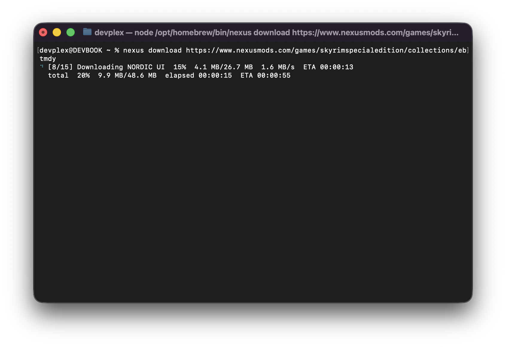

# Nexus CLI

Enables automated downloads of individual mods and collections from [Nexus](https://nexusmods.com) without a premium
subscription.



> **Note:** this does not unlock premium download speeds. It uses the same free
> "slow download" the website gives you — it just saves you from clicking
> through every mod and collection by hand.

## Install

```sh
npm install -g @carlelieser/nexus-cli
```

## Usage

Log in to [Nexus](https://users.nexusmods.com/) in your browser and run the following command to import your session.

```sh
nexus import --from chrome
```

Download an individual mod:

```sh
nexus download https://www.nexusmods.com/skyrimspecialedition/mods/12604
```

Download an entire collection:

```sh
nexus download https://www.nexusmods.com/games/skyrimspecialedition/collections/abc123
```

Run `nexus --help` for all commands and flags.
